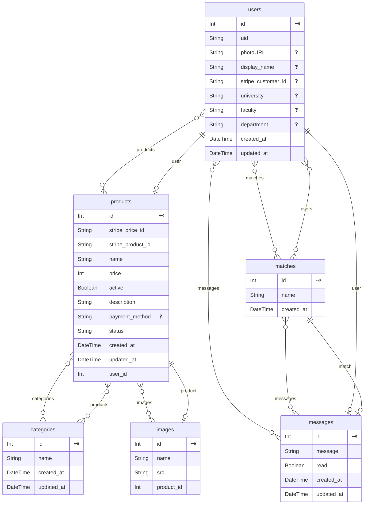

```mermaid
erDiagram

  "users" {
    Int id "🗝️"
    String uid 
    String photoURL "❓"
    String display_name "❓"
    String stripe_customer_id "❓"
    String university "❓"
    String faculty "❓"
    String department "❓"
    DateTime created_at 
    DateTime updated_at 
    }
  

  "products" {
    Int id "🗝️"
    String stripe_price_id 
    String stripe_product_id 
    String name 
    Int price 
    Boolean active 
    String description 
    String payment_method "❓"
    String status 
    DateTime created_at 
    DateTime updated_at 
    Int user_id 
    }
  

  "images" {
    Int id "🗝️"
    String name 
    String src 
    Int product_id 
    }
  

  "categories" {
    Int id "🗝️"
    String name 
    DateTime created_at 
    DateTime updated_at 
    }
  

  "matches" {
    Int id "🗝️"
    String name 
    DateTime created_at 
    }
  

  "messages" {
    Int id "🗝️"
    String message 
    Boolean read 
    DateTime created_at 
    DateTime updated_at 
    }
  
    "users" o{--}o "products" : "products"
    "users" o{--}o "matches" : "matches"
    "users" o{--}o "messages" : "messages"
    "products" o|--|| "users" : "user"
    "products" o{--}o "categories" : "categories"
    "products" o{--}o "images" : "images"
    "images" o|--|| "products" : "product"
    "categories" o{--}o "products" : "products"
    "matches" o{--}o "users" : "users"
    "matches" o{--}o "messages" : "messages"
    "messages" o|--|| "users" : "user"
    "messages" o|--|| "matches" : "match"
```
